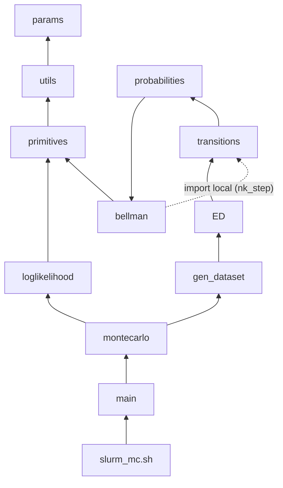

# Documentación del código

Todo el código de `claude/scripts/`: qué objeto hay en cada archivo, qué recibe, qué
devuelve (con formas) y cómo se conectan. El foco es `modelo_fin/` (el modelo de la
tesis). `gillingham/` y `comparacion/` van al final, más breves.

Estado: v1.7 (sin matrices densas; estimación estructural en `theta.py`, `equilibrium.py`,
`estructural.py`, `estimar.py`; análisis en `analisis/`). La sección 10 resume lo de v1.7;
el detalle de uso y salidas está en `reporte_estimacion.md`. Fases 2-5 del plan van a cambiar partes de esto
(parámetros dinámicos, dos tipos, chatarreo opcional, log-odds); este documento se
actualiza con cada versión.

Contenido:
0. Conceptos de JAX y Python que usa el código
1. Mapa de carpetas
2. Mapa de dependencias entre archivos
3. El modelo en el código: estados, tiempo dentro del periodo, formas
4. Cómo fluye un equilibrio (de Params a P y q)
5. Archivo por archivo (`modelo_fin/`)
6. Cómo fluye el Monte Carlo
7. `gillingham/`
8. `comparacion/`
9. Trampas y preguntas frecuentes

---

## 0. Conceptos de JAX y Python que usa el código

Si ya los conoces, salta a la sección 1.

### JAX

JAX es numpy (`jax.numpy as jnp`) más tres cosas: compilar, derivar y correr en GPU.

| concepto | qué es | dónde aparece |
|---|---|---|
| `jnp` | igual que numpy, pero los arreglos son de JAX (inmutables, pueden vivir en GPU) | en todo el modelo |
| `jax.jit` | compila una función la primera vez que se llama con ciertas formas; las siguientes llamadas corren la versión compilada (mucho más rápida) | `T`, `ccps`, `nk_step`, `ed_log_jit`, `physical_matrices` |
| `static_argnames="g"` | `g` no es un arreglo sino un objeto de Python: JAX lo trata como constante y **recompila si cambia**. Por eso `Params` es frozen (hashable) | todas las funciones jiteadas |
| `jax.jvp(f, (x,), (v,))` | derivada direccional: J_f(x) · v, exacta, al costo de ~2-3 evaluaciones de f, sin armar J | `ED.make_jvp` |
| `jax.vjp` | lo mismo por la izquierda: w^T · J_f(x) | (Fase 2: gradiente implícito) |
| `jax.jacfwd` | el jacobiano completo (caro: una jvp por columna) | `tests.py` (solo tamaño chico) |
| `jax.grad`, `value_and_grad`, `hessian` | gradiente / valor + gradiente / hessiano de una función escalar | `loglikelihood.estim_ll` |
| `jax.lax.scan` | un ciclo for compilable que va acumulando ("carry") y guardando salidas | `transitions.stationary_q` (recursión en la edad) |
| `jax.lax.fori_loop`, `while_loop` | ciclos compilables con número fijo o con condición | `utils.gmres` |
| pytree | cualquier estructura anidada (dict, tuple, NamedTuple) de arreglos; JAX la recorre por dentro | `CCP`, `Values`, `Market`, los dicts de θ |
| `ravel_pytree` | convierte un dict de parámetros en un vector plano (y devuelve cómo deshacerlo) | `estim_ll` |
| `jax_enable_x64` | por defecto JAX usa float32; aquí se activa float64 porque las tolerancias son de 1e-12 | `utils.py` (al importarse) |

**Regla dentro de funciones jiteadas:** no hay `if` de Python sobre valores de arreglos
(el valor no se conoce al compilar). Se usa `jnp.where(cond, a, b)`. Los `if` sobre `g`
sí se permiten (g es constante).

### Python

| concepto | qué es | dónde |
|---|---|---|
| `@dataclass(frozen=True)` | clase de datos inmutable; se puede usar como llave de diccionario (hashable), que es lo que jit necesita para un argumento estático | `Params`, `MCDesign` |
| `dataclasses.replace(g, campo=valor)` | copia de g con un campo cambiado (no se puede modificar g directamente) | cambiar `n_s`, `repair_price`, ... |
| `NamedTuple` | tupla con nombres (`c.keep`, `c.buy`); es un pytree | `CCP`, `Values`, `Market`, `Equilibrium`, `Kernel` |
| `functools.partial` | fija argumentos de una función; aquí se usa como `@partial(jax.jit, static_argnames="g")` | decoradores |
| `einsum` | producto de arreglos escrito con letras de ejes: `"jdst,jdt->jds"` = para cada (j, d, s), sumar sobre t | `bellman`, `transitions` |

---

## 1. Mapa de carpetas

```
claude/
├── scripts/
│   ├── modelo_fin/        el modelo de la tesis (con s y reparación no observada)
│   ├── gillingham/        réplica de Gillingham et al. (sin s, con chatarreo endógeno)
│   └── comparacion/       corre los dos modelos y compara equilibrios
├── docs/                  documentación (este archivo, decisiones, resultados)
└── output/montecarlo/     resultados del Monte Carlo (CSV, npz)
```

Cómo correr (siempre desde la carpeta del script y con `PYTHONIOENCODING=utf-8`):

```
cd claude/scripts/modelo_fin
python tests.py                 # pruebas (añadir --ed para el equilibrio, --n_s 12 para chico)
python main.py --smoke          # Monte Carlo de humo (minutos)
python main.py --solve-only     # resolver y guardar los equilibrios de un diseño
python main.py --reps 0:10      # bloque de réplicas
```

---

## 2. Mapa de dependencias entre archivos

Una flecha `A --> B` significa "A importa algo de B".

```
                               params.py
                          (Params: todos los números)
                                   │ (g se pasa como argumento, no se importa)
                                   ▼
                               utils.py
            dims, grid de s, layout X/H, initial_prices, gmres
                                   ▲
                                   │
                             primitives.py
         flow_utility, sell_cost, s_transition, emax, choice_probs
                                   ▲
                                   │
                              bellman.py ◄─────────────────────┐
     continuation_values, repair_stage, choice_values, T,      │ (import local dentro
     nk_step, solve_bellman                                    │  de nk_step: evita
                                   ▲                           │  el ciclo)
                                   │                           │
                           probabilities.py                    │
                         CCP, ccps (las CCPs)                  │
                                   ▲                           │
                                   │                           │
                            transitions.py ────────────────────┘
       Kernel, holding_kernel, M_apply, stationary_q, ... (+ densas para pruebas)
                                   ▲
                                   │
                                ED.py
       Market, market_components, excess_demand_log, make_jvp, solve_equilibrium
                                   ▲
                                   │
                            gen_dataset.py                  loglikelihood.py
         solve_regimes, simulate_panel, view, to_cells     treat_data, ll_*, estim_ll
                                   ▲                              ▲    (solo usa utils
                                   │                              │     y primitives)
                                   └────────── montecarlo.py ─────┘
                                       MCDesign, prepare, one_mc, montecarlo
                                                    ▲
                                                    │
                                                main.py  ◄── slurm_mc.sh (supercomputadora)

  tests.py importa casi todo.     comparacion/compare.py carga modelo_fin/ y gillingham/.
```

La misma estructura en Mermaid (se ve como diagrama en GitHub o en VS Code con la
extensión de Mermaid):



---

## 3. El modelo en el código

### 3.1 Los dos vectores de estados

Todo objeto "por estado" es un vector de largo n = J(A−1)S + J + 1 (1,804 con J = 3,
a_max = 7, n_s = 100; 7,204 con a_max = 25). Hay dos lecturas del mismo largo:

```
X (inicio del periodo, antes de comerciar)      H (tenencia: lo que manejas este periodo)
┌───────────────────────────────────────┐      ┌───────────────────────────────────────┐
│ act(j=0, a=1, s=0..S-1)               │      │ used(j=0, d=1, s=0..S-1)              │
│ act(j=0, a=2, s=...)                  │      │ used(j=0, d=2, s=...)                 │
│   ...                                 │      │   ...                                 │
│ act(j=J-1, a=A-1, s=S-1)              │ ← n_act = J(A-1)S filas en las dos lecturas
├───────────────────────────────────────┤      ├───────────────────────────────────────┤
│ term(j=0..J-1)  coche que murió       │      │ new(j=0..J-1)  coche nuevo comprado   │ ← J filas
├───────────────────────────────────────┤      ├───────────────────────────────────────┤
│ none   sin coche                      │      │ none   sin coche                      │ ← 1 fila
└───────────────────────────────────────┘      └───────────────────────────────────────┘
```

- **El índice de act(j, a, s) es el mismo en X y en H.** Quedarse el coche manda x = i a
  h = i.
- **El "truco de Gillingham":** en H no existe "terminal" (nadie maneja un coche
  muerto), así que esas J filas se reciclan para los coches nuevos. Así Ω (X -> H) y
  Q (H -> X) son cuadradas.
- Índice de act(j, a, s) = (j (A−1) + (a−1)) S + s.
- **Nunca se indexa a mano:** `split_states(v, g)` -> (act (J, A−1, S), term (J,),
  none ()) y `stack_states(act, term, none)` hace lo inverso. `decode_states(idx, g)`
  convierte índices a (tipo, j, a, s) en numpy (para la simulación).

### 3.2 Qué pasa dentro de un periodo

```
 inicio en x ∈ X
   │
   ├─ x = act(j, a, s) ──► ETAPA 1 (shock logit, escala sigma):
   │                         ├─ keep  ──────────────────────────► h = x
   │                         ├─ purge: vende (mu P − Ts) ───────► h = none
   │                         └─ trade: vende y compra ──► nido de compra (sigma_trade):
   │                                                       ├─ usado (j', d') ─► nido de s (sigma_s) ─► h = used(j', d', s')
   │                                                       └─ nuevo j' ──────────────────────────────► h = new(j')
   ├─ x = term(j) ──► purge (cobra mu p_scrap) o trade (cobra mu p_scrap y compra)
   └─ x = none ─────► seguir sin coche o trade (paga además tc_buy_nocar)
   │
   ▼
 tenencia h ∈ H
   │
   ├─ h usado ──► ETAPA 2 (shock nuevo, escala sigma_repair): reparar (paga mu R(j, d)) o no
   │              (los nuevos no se reparan)
   ▼
 manejas h: utilidad u(h)
   │
   ▼
 transición física Q:
   ├─ con prob s (o 1 si d = A−1): el coche muere ─► x' = term(j)
   └─ si sobrevive: s' = m(r, j, d, s) + eta ─────► x' = act(j, d+1, s')
       m = s_const_j + s_age d + s_persist s − s_repair r   (opción 2: r solo mueve la media)
```

### 3.3 Las tres "matrices" del modelo

| objeto | de -> a | qué es | en el código |
|---|---|---|---|
| Ω | X -> H | la etapa 1: Ω(x, h) = Pr(terminar con h \| x) | `trade_matrices` (densa, pruebas); por estructura: `holding_distribution` |
| Q | H -> X | etapa 2 + física: Q(h, x') = Pr(x' \| h), con r integrada | `Kernel` + `holding_apply` / `holding_rapply` |
| M = ΩQ | X -> X | transición completa de un año | `M_apply` (M v), `M_rapply` (q M) |

La estructura de Ω que se aprovecha (sin armar nada de n × n):

```
Ω = diag(keep)            (te quedas el coche: x = h)
  + trade ⊗ buy           (rango 1: lo que compras no depende de qué tenías)
  + purge ⊗ e_none        (una sola columna: none)
```

### 3.4 Formas (con J = 3, a_max = A = 7, n_s = S = 100)

| nombre | forma | qué es |
|---|---|---|
| `EV` | (n,) = (1804,) | valor esperado al inicio del periodo, sobre X |
| `P` | (J, A−1, S) = (3, 6, 100) | precios de usados, miles de DKK |
| `grid` | (S,) | puntos del grid de s en [s_min, s_max] |
| `F` | (2, J, A, S, S) | F[r, j, d, s, s'] = Pr(s' \| s, j, d, r, sobrevive), d = 0..A−1 |
| `u` | (J, A, S) | utilidad de flujo, d = 0..A−1 (d = 0: nuevo) |
| `cv_used` | (2, J, A−1, S) | β E[EV(x') \| h usado, r] |
| `cv_new` | (J,) | β E[EV(x') \| h nuevo] |
| `W` | (J, A−1, S) | valor de tener el usado h después de la etapa 2 (emax sobre r) |
| `repair_price` | J tuplas de A−1 | R(j, a), a = 1..A−1 |
| CCPs `c.keep/purge/trade` | (n,) sobre X | |
| `c.buy` | (n,) sobre H | Pr(comprar h \| trade); 0 en none |
| `c.repair` | (n,) sobre H | Pr(reparar \| h); 0 en nuevos y none |
| `q` | (n,) sobre X | distribución estacionaria |
| `Kernel.used` | (J, A−1, S, S) | usado -> act(d+1), ya con (1 − s) y la mezcla en r |

---

## 4. Cómo fluye un equilibrio

```
 Params g ──► initial_prices(g) ──► P0
                                     │
          ┌──────────────────────────┴───────────────────────────────────────────┐
          │  solve_equilibrium(g)                                   (ED.py)       │
          │                                                                      │
          │  repetir (tâtonnement, luego Newton-Krylov sobre P):                  │
          │                                                                      │
          │   P ──► solve_bellman(P, g) ──► EV          (bellman.py)              │
          │          │  SA: EV ← T(EV, P) hasta 1e-6                              │
          │          │  NK: EV ← EV − (I − βM)⁻¹(EV − T(EV))   [nk_step, GMRES]   │
          │          ▼                                                           │
          │   (EV, P) ──► ccps ──► c = (keep, purge, trade, buy, repair)          │
          │                          │                                           │
          │                          ├──► stationary_q(c, g) ──► q   (recursión)  │
          │                          ▼                                           │
          │   excess_demand_log: log D − log max(S, piso)                        │
          │       D(h) = (q · trade) · buy(h)       demanda de usados             │
          │       S(x) = q(x) (1 − keep(x))          oferta de usados             │
          │                          │                                           │
          │   ¿max |ED| < ed_tol? ── no ──► mover P  (tât: P += damp·σs/μ·ED;      │
          │          │                               NK: GMRES con make_jvp)       │
          │          sí                                                          │
          └──────────┼───────────────────────────────────────────────────────────┘
                     ▼
         Equilibrium(P, EV, ed, empty, converged, iters)
```

Dentro de `T(EV, P, g)`, qué llama a qué:

```
T ──► choice_values(EV, P, g) ──┬─► flow_utility(g)                 u(j, d, s)
 │                               ├─► continuation_values(EV, g) ──► s_transition(g) ──► F
 │                               ├─► repair_stage(EV, g) ─────────► W = emax(no reparar, reparar)
 │                               ├─► sell_cost(g)                  Ts(a)
 │                               └─► buy_inclusive(...)            valor inclusivo de comprar
 └──► emax([keep, purge, trade], sigma) por estado ──► EV nuevo
```

---

## 5. Archivo por archivo (`modelo_fin/`)

### 5.1 `params.py`

**`Params`** (dataclass frozen). Todos los números del modelo y de los solvers. Los
"vectores" son tuplas para que sea hashable (requisito de `static_argnames`).

| grupo | campos | notas |
|---|---|---|
| estructurales | `beta`, `mu`, `u0`, `u1`, `u2`, `u_s`, `u_none` | u0, u1 de Gillingham (Tablas 8-9); u_s propio |
| costos de transacción | `tc_buy`, `tc_buy_nocar`, `tc_sell`, `tc_sell_inspect`, `inspect_age_min` | Tablas 5 y 10 |
| precios exógenos | `p_new`, `p_scrap`, `repair_price` | R(j, a) es la variable excluida |
| shocks | `sigma`, `sigma_trade`, `sigma_s`, `sigma_repair` | GEV válido: 0 < sigma_s <= sigma_trade <= sigma |
| estados | `n_brands`, `a_max`, `s_min`, `s_max`, `n_s`, `s_new` | |
| transición de s | `s_const`, `s_age`, `s_persist`, `s_repair`, `s_sigma` | m = s_const_j + s_age d + s_persist s − s_repair r |
| equilibrio | `dep_factor`, `ed_floor`, `ed_tol`, `ed_mass_tol`, `tat_*`, `nk_ed_max_iter`, `gmres_tol`, `gmres_restart`, `gmres_maxiter` | |
| Bellman | `sa_tol`, `sa_max_iter`, `vfi_tol`, `nk_max_iter` | |
| MC | `mc_replic` | |

`__post_init__` revisa longitudes y desigualdades (lanza ValueError si algo no cuadra).
`_default_repair_prices()` arma R(j, a) = base_j (1 + 0.15 (a − 1)).

Para otro año de precios de reparación: `dataclasses.replace(g, repair_price=...)`.

### 5.2 `utils.py`

| objeto | entrada -> salida | qué hace |
|---|---|---|
| (al importar) | | activa float64 en JAX |
| `dims(g)` | -> (J, A, S, n_act, n) | las dimensiones; casi toda función empieza con esto |
| `make_s_grid(g)` | -> (S,) | `linspace(s_min, s_max, n_s)` |
| `s_new_index(g)` | -> int de Python | índice del grid más cercano a s_new (numpy: tiene que ser estático) |
| `split_states(x, g)` | (n,) -> (act (J, A−1, S), term (J,), none ()) | partir un vector de estados |
| `stack_states(act, term, none)` | -> (n,) | lo inverso |
| `decode_states(idx, g)` | índices -> (tipo, j, a, s) | tipo 0 = act/used, 1 = term/new, 2 = none; en H, los nuevos tienen a = 0 |
| `initial_prices(g)` | -> (J, A−1, S) | P0 = max(p_new dep^a (1 − s), p_scrap): arranque del equilibrio |
| `gmres(A, b, x0, tol, restart, maxiter, M)` | función lineal A, vector b -> x | GMRES propio con jnp/lax. Ver `newton_krylov.md`. Existe porque el de jax.scipy no se puede anidar |

### 5.3 `primitives.py`

Las piezas "primitivas" del modelo: no dependen de EV ni de P.

| objeto | salida | fórmula |
|---|---|---|
| `flow_utility(g)` | (J, A, S) | u0_j + u1_j d + u2_j d² + u_s s, d = 0..A−1 |
| `sell_cost(g)` | (A−1,) | Ts(a) = tc_sell_inspect si a par >= inspect_age_min, si no tc_sell |
| `s_transition_rows(mean, sd, grid)` | mean.shape + (S,) | discretiza N(mean, sd²) en el grid: probabilidad de caer en el intervalo de cada punto; las colas se acumulan en los extremos |
| `s_mean_next(g)` | (2, J, A, S) | m(r, j, d, s) |
| `s_transition(g)` | (2, J, A, S, S) | F = s_transition_rows(s_mean_next(g), s_sigma, grid) |
| `emax(values, sigma)` | | E max{v_k + sigma ε_k} = sigma logsumexp(v / sigma) (sin la constante de Euler) |
| `choice_probs(values, sigma)` | eje 0 = alternativa | probabilidades logit |

**La distribución de los errores solo entra por `emax` y `choice_probs`.** Para usar otra
distribución bastaría con cambiar esas dos funciones (y revisar que dT/dEV = βM siga
valiendo).

### 5.4 `bellman.py`

| objeto | entrada -> salida | qué hace |
|---|---|---|
| `continuation_values(EV, g)` | -> cv_used (2, J, A−1, S), cv_new (J,) | β E[EV(x') \| h, r]: sobrevive con (1 − s) y va a act(d+1, s'), o muere y va a term. La última edad va a term con certeza |
| `repair_stage(EV, g)` | -> (vals, W) | etapa 2: vals = [cv_used[0], −mu R + cv_used[1]]; W = emax(vals, sigma_repair) |
| `buy_inclusive(buy_used, buy_new, g)` | -> (iv_buy, I_jd) | valores inclusivos del nido de compra: I_jd = sigma_s logsumexp sobre s; iv_buy = sigma_trade logsumexp sobre {(j, d), nuevos} |
| `log_buy_probs(buy, g)` | (n−1,) -> (n−1,) | log Pr(comprar h \| trade) = log Pr(j, d) + log Pr(s \| j, d) |
| `Values` | NamedTuple | los valores de cada alternativa (abajo) |
| `choice_values(EV, P, g)` | -> Values | arma todo lo de la etapa 1 |
| `T(EV, P, g)` | (n,) -> (n,) | operador de Bellman (jit): emax por estado |
| `nk_step(EV, P, g)` | -> (EV nuevo, error) | un paso de Newton-Kantorovich con GMRES (jit) |
| `solve_bellman(P, g, EV_init)` | -> EV | aproximaciones sucesivas (jaxopt) hasta sa_tol, luego nk_step hasta vfi_tol |

`Values` (lo que vale cada alternativa, en utils):

```
keep       = u(h) + W(h)                               (h = x)
sell       = mu P − Ts(a)                              (lo que cobra quien vende)
purge_act  = sell + u_none + β EV(none)
trade_act  = sell + iv_buy
purge_term = mu p_scrap + u_none + β EV(none)
trade_term = mu p_scrap + iv_buy
stay_none  = u_none + β EV(none)
trade_none = −tc_buy_nocar + iv_buy
buy(used h) = u(h) − mu P(h) − tc_buy + W(h)
buy(new j)  = u(new j) − mu p_new_j − tc_buy + cv_new_j
```

**Por qué dT/dEV = βM:** la derivada de emax respecto a cada valor es su probabilidad
de elección. Con la regla de la cadena por las dos etapas sale Ω · Q = M. Se verifica en
`tests.test_jacobians` (error de 1e-15).

### 5.5 `probabilities.py`

**`CCP`** (NamedTuple, todos de largo n):

| campo | sobre | qué es |
|---|---|---|
| `keep` | X | Pr(keep \| x); 0 en term y none |
| `purge` | X | Pr(purge \| x); en none es "seguir sin coche" |
| `trade` | X | Pr(trade \| x) |
| `buy` | H | Pr(comprar h \| trade); 0 en none. No depende de x |
| `repair` | H | Pr(reparar \| h); 0 en nuevos y none |

**`ccps(EV, P, g)`** (jit) -> CCP. Llama a `choice_values` y aplica `choice_probs` en
cada nodo del árbol.

### 5.6 `transitions.py`

**Sin matrices (lo que se usa):**

| objeto | entrada -> salida | qué hace |
|---|---|---|
| `Kernel` | NamedTuple | `used` (J, A−1, S, S), `p_term` (A−1, S), `new` (J, S), `s0` () |
| `holding_kernel(c, g)` | -> Kernel | Q en forma compacta, con la etapa 2 integrada: F_mix = (1 − p_rep) F_0 + p_rep F_1 |
| `holding_apply(v, K, g)` | v sobre X -> sobre H | Q v = E[v(x') \| h] |
| `holding_rapply(w, K, g)` | w sobre H -> sobre X | w Q (adonde va una masa de tenencias) |
| `holding_distribution(q, c)` | q sobre X -> sobre H | q Ω = keep ⊙ q + <q, trade> buy + <q, purge> e_none |
| `M_apply(v, c, K, g)` | sobre X -> sobre X | M v = keep ⊙ (Q v) + trade <buy, Q v> + purge v(none) |
| `M_rapply(q, c, K, g)` | sobre X -> sobre X | q M = (q Ω) Q |
| `stationary_q(c, g)` | -> q (n,) | q = qM exacta por recursión en la edad (abajo) |
| `observed_s_transition(c, g)` | -> (J, A−1, S, S) | la mezcla que ve el econometrista, (1 − p) F_0 + p F_1 |

`stationary_q` en dibujo (con masa compradora m = 1; al final se normaliza):

```
compras: buy_new(j) ──► act(j, 1, ·) = buy_new(j) · K.new(j, ·)
                              │
                              ▼  hold = act · keep + buy_used(j, 1, ·)     ← se quedan + llegan comprados
                              │
                              ▼  @ K.used(j, 1)                            ← sobreviven, nuevo s'
                         act(j, 2, ·)
                              │  ... (lax.scan sobre la edad)
                              ▼
                         act(j, A−1, ·)

term(j) = sum_{d,s} hold · p_term + buy_new(j) · s0            ← los que mueren
none    = (sum act · purge_act + sum term · purge_term) / Pr(trade | none)
q       = [act | term | none] / suma
```

Funciona porque todo coche activo viene de una compra y `buy` no depende de x. Solo
suma productos no negativos: precisión relativa de máquina aun en celdas de 1e-15.

**Densas (solo para pruebas a tamaño chico):** `physical_matrices` (Q_0, Q_1),
`holding_transition` (Q), `trade_matrices` (Ω por partes), `transition_from_ccps` y
`transition_matrix` (M), `stationary_distribution` (resuelve q = qM con un solve). Con
a_max = 25 cada una ocupa ~415 MB: no usarlas fuera de `tests.py`.

### 5.7 `ED.py`

| objeto | qué es |
|---|---|
| `Market` | NamedTuple con todo el mercado en (EV, P): q, q_hold, keep, trade, purge, buy_used, buy_new, repair, trade_mass, demand, supply. Para reportar |
| `market_components(EV, P, g)` | arma `Market` |
| `excess_demand_log(EV, P, g)` | (J, A−1, S): log D − log max(S, ed_floor). log D se calcula analíticamente (log masa + log buy), sin underflow |
| `ed_log_jit` | la anterior compilada |
| `excess_demand(P, g, EV_init)` | resuelve la Bellman en P y devuelve (ED, EV) |
| `make_jvp(EV, P, g)` | devuelve la función v -> J_ED(P) v. Por dentro: dT = jvp de T en P; dEV = (I − βM)⁻¹ dT con GMRES; luego jvp de ED en (EV, P) |
| `Equilibrium` | NamedTuple: P, EV, ed, empty (celdas sin masa), converged, iters |
| `solve_equilibrium(g, P_init, EV_init, verbose)` | 1) tâtonnement: P += tat_damp · (sigma_s/mu) · ED hasta tat_tol; 2) Newton-Krylov: GMRES con `make_jvp` y precondicionador diagonal, más búsqueda lineal (divide el paso entre 2 hasta 12 veces) |

**Por qué en logs:** D y S van de ~1e-1 a ~1e-15 entre celdas. En niveles, las celdas
chicas no pesan nada y el jacobiano es casi singular; en logs todas pesan igual y la
derivada de log D respecto a P(h) es ~ −mu/sigma_s.

**Celdas sin masa:** si S y D están por debajo de ed_mass_tol, el precio que sale no
significa nada (nadie compra ni vende ahí). Se marcan en `empty`.

### 5.8 `gen_dataset.py`

| objeto | qué hace |
|---|---|
| `regime_params(g, zeta)` | g con R × exp(zeta): el "año" con precios de reparación desplazados |
| `solve_regimes(g, zetas, path)` | resuelve un equilibrio por régimen (arrancando del anterior) y guarda en .npz: R, P, EV, q, CCPs, empty, converged y F. Si el archivo existe, lo carga |
| `load_regimes(path)` | lee el .npz |
| `_next_state(h, r, cumF, g, rng)` | transición física por hogar: muere con prob s (o 1 en la última edad); si no, sortea s' de F_r |
| `_sample_cat(p, size, rng)` | sortear de una distribución discreta |
| `simulate_panel(regs, g, N, K, seed)` | por régimen: N hogares desde q_t, K periodos. Etapa 1 (keep/purge/trade y qué compra), etapa 2 (r), transición. Devuelve un DataFrame con todo (tabla "verdad") |
| `view(df, escenario)` | "oraculo": todo; "ideal": quita r, p_rep, p_keep, p_trade, P_h |
| `to_cells(df, g)` | agrega como los datos daneses: decisiones por (t, j, a), salidas y compras por (t, j_h, d_h) |
| `gen_dataset(regs, g, seed, N, K, escenario)` | simula y devuelve la vista pedida |

Columnas del panel: `id_hogar, t, k, id_coche, estado, j, a, s_idx, decision, tipo_h,
j_h, d_h, s_h_idx, r, p_rep, p_keep, p_trade, accidente, fin_vida, s_next_idx, P_h, s_h,
s_next`.

La simulación es numpy, no JAX: es muestreo y no hay nada que derivar.

### 5.9 `loglikelihood.py` (primera etapa de Hu & Xin)

Usa solo las transiciones de s de las tenencias que sobreviven. No resuelve el modelo.
Todavía está en niveles de s (pasará a log-odds en la Fase 3).

| objeto | qué hace |
|---|---|
| `treat_data(df, g, R, with_r)` | agrega a celdas (t, j, d, s, s', [r]) con conteos; calcula los bordes [lo, hi) del intervalo de s' |
| `cell_prob(mean, sd, lo, hi)` | Pr(s' en [lo, hi)) con s' ~ N(mean, sd²) |
| `s_params(th)` | parámetros de s en escala natural (s_repair = exp, sd = exp) |
| `mean_r(th, data, r)` | m(r, j, d, s) |
| `p_repair(th, data, spec)` | Pr(reparar \| h, t): "flexible" (un α por año, marca y edad, más g1 s + g2 s²) o "logit_R" (α_j + α_d − b_R R_t + ...) |
| `ll_oracle` | ve r: Σ cnt log F_r(s') |
| `ll_naive` | ignora la reparación: s_repair = 0 |
| `ll_hx` | r oculta: Σ cnt log[(1 − p) F_0 + p F_1] |
| `start_values(g, kind, spec, n_regimes)` | valores iniciales de θ |
| `estim_ll(kind, data, th0, spec, se)` | minimiza −LL/N con L-BFGS-B (scipy) y gradiente de JAX; errores estándar por el hessiano |
| `summarize_theta`, `true_theta` | θ estimado / verdadero en escala natural, para comparar |

### 5.10 `montecarlo.py`, `main.py`, `slurm_mc.sh`

| objeto | qué hace |
|---|---|
| `MCDesign` | N (hogares por régimen), K (periodos por hogar), T (regímenes), spread (zeta en [−spread, spread]), spec, se; `tag` arma el nombre de los archivos |
| `prepare(g, design, outdir)` | resuelve (o carga) los regímenes: la parte cara, una vez por diseño |
| `_eval_points(df, g, R)` | las celdas donde se mide qué tan bien se recupera Pr(repair) |
| `one_mc(rep, regs, g, design)` | simula con semilla rep, estima oráculo / ingenuo / hx y devuelve una fila con estimaciones y el error en Pr(repair) (sesgo, RMSE, RMSE por edad) |
| `montecarlo(g, design, reps, outdir)` | corre un bloque de réplicas y escribe un CSV después de cada una (si el trabajo se cae, lo hecho queda) |
| `main.py` | línea de comandos: `--reps a:b`, `--N`, `--K`, `--T`, `--spread`, `--spec`, `--n_s`, `--se`, `--solve-only`, `--smoke` |
| `slurm_mc.sh` | plantilla para la supercomputadora: `STEP=solve` resuelve los regímenes una vez; luego un array de tareas, cada una con 10 réplicas. Hoy está hecha para CPU; se rehace para GPU en la Fase 5 |

### 5.11 `tests.py`

| prueba | qué verifica |
|---|---|
| `test_model` | filas de Ω y Q suman 1; M rápida == ΩQ densa; q >= 0, suma 1, q = qM; `decode_states` es la inversa del layout |
| `test_matrix_free` | Q v, w Q, M v, q M sin matrices == densas; q por recursión == q densa; Bellman + q con a_max = 25 |
| `test_jacobians` | dT/dEV == βM (autodiff contra la fórmula); J_ED v (jvp) contra diferencias finitas |
| `test_equilibrium` (`--ed`) | el equilibrio converge y D = S en celdas con masa |

---

## 6. Cómo fluye el Monte Carlo

```
main.py ──► MCDesign(N, K, T, spread, spec)
   │
   ├─ prepare ──► solve_regimes ──► para t = 1..T:  g_t = g con R × exp(zeta_t)
   │                                  solve_equilibrium(g_t) ──► P_t, EV_t ──► ccps, stationary_q
   │                               └──► regimes_*.npz   (una vez por diseño; lo caro)
   │
   └─ para cada réplica rep (montecarlo ──► one_mc):
         simulate_panel(regs, seed = rep) ──► df "verdad"
             │
             ├─ treat_data(df, with_r)        ──► estim_ll("oracle")  ─┐
             ├─ treat_data(view(df, "ideal")) ──► estim_ll("naive")   ─┤
             │                                └─► estim_ll("hx")      ─┤  (arranca del ingenuo)
             └─ _eval_points ──► error en Pr(repair | h) ──────────────┤
                                                                       ▼
                                                  una fila del CSV mc_<diseño>_reps<a>-<b>.csv
```

---

## 7. `gillingham/`

Réplica de Gillingham et al. Mismo layout que `modelo_fin` pero **sin s**: el estado es
(j, a) y la prob. de accidente es un logit en la edad (Tabla 4). Tiene **chatarreo
endógeno** (nido vender/chatarrear con sigma_sell) y ya tiene la maquinaria de
estimación que `modelo_fin` recibirá en las Fases 2 y 4. Resultados en `gillingham.md`.

| archivo | objetos principales |
|---|---|
| `params.py` | `GParams` (frozen), `PAPER_TYPES` (los 4 tipos "Low WD" de las Tablas 7-10), `GTypes(names, f)` |
| `utils.py` | `dims`, `split_states`, `stack_states`, `initial_prices` |
| `bellman.py` | `flow_utility`, `accident_prob`, `sell_cost`, `emax`, `choice_probs`, `continuation_values`, `Values`, `choice_values`, `T_raw` (sin jit), `T` (jit), `solve_bellman` |
| `probabilities.py` | `CCP` (con `scrap`), `ccps_raw` |
| `transitions.py` | `physical_matrix_raw`, `transition_from_ccps`, `transition_matrix`, `stationary_distribution` (densas: con a_max = 25 son 76 estados, no hace falta más) |
| `ED.py` | `GMarket`, `market_components`, `excess_demand_log`, `GEquilibrium`, `solve_equilibrium` (Newton con jacobiano denso) |
| `theta.py` | **`GModel(g, th)`**: un tipo, parámetros como pytree dinámico. **`Economy(g, th, f)`**: T tipos con fracciones f. `FIELDS`, `TYPE_FIELDS`, `TRANSFORM` (mu = exp, sigma_sell = logística). `pack` / `unpack` / `free_spec` / `natural`: vector libre x <-> θ |
| `equilibrium.py` | Newton conjunto sobre z = (EV_0, ..., EV_{T−1}, P): `split_z`, `type_market`, `excess_demand_log`, `residual` (F(z)), `solve`, `solve_or_restart` |
| `simulate.py` | `simulate_panel` (panel desde q, con o ∈ {keep, purge vende, purge chatarrea, trade vende, trade chatarrea}), `to_cells` |
| `loglikelihood.py` | `treat_data`, `outcome_probs`, `cell_logp` (verosimilitud parcial: sin precios ni accidentes; o completa), `LLEval` (LL, gradiente implícito, scores), `estim_lbfgs`, `estim_bhhh`, `estimate` |
| `montecarlo.py`, `main.py` | `MCDesign`, `prepare`, `estimate` (varios arranques), `one_mc`, `montecarlo`, `summarize` |
| `tests.py` | pruebas (incluye el solver conjunto y el gradiente implícito contra diferencias finitas) |

Cómo se conectan los objetos de estimación:

```
GParams g ──► theta.economy(g, GTypes) ──► Economy(g, th, f)       (pytree: th dinámico)
                                               │
          x (vector libre) ◄── pack / unpack ──┤
                                               ▼
                         equilibrium.solve(eco) ──► z = (EV_t..., P)      Newton conjunto, jit
                                               │
                    loglikelihood.LLEval ──────┤  LL(x) = Σ conteos · log Pr(celda | z(x), x)
                                               │  dLL/dx por función implícita: dz/dx = −F_z⁻¹ F_x
                                               ▼
                    estim_lbfgs ──► estim_bhhh ──► θ̂, errores estándar (BHHH)
```

**Diferencias clave con `modelo_fin`:** no hay s ni reparación; Ts por edad con
inspección; hay chatarreo; usa matrices densas (76 estados con a_max = 25, cabe); los
parámetros ya son dinámicos (no recompila con θ nuevo).

---

## 8. `comparacion/compare.py`

Carga los dos paquetes por separado. Los dos tienen `params.py`, `bellman.py`, ...,
con los mismos nombres, así que `load(pkg)` borra esos módulos de `sys.modules`, pone la
carpeta del paquete al frente de `sys.path`, los importa y devuelve un dict con ellos.
Corre:
- G25 (Gillingham, a_max = 25), G7 (a_max = 7),
- M7 (modelo_fin con los defaults), M7_gill (modelo_fin con s calibrada a la Tabla 4,
  `gill_like_s`),

y escribe CSV en `comparacion/output/` con precios, keep / trade / purge, accidentes y
Pr(repair) por edad. Resultados en `gillingham.md`.

---

## 9. Trampas y preguntas frecuentes

1. **"Cambié un parámetro y tardó mucho la primera vez."** Es la recompilación: g es
   estático en jit, y un g distinto es otra función. En `modelo_fin` pasa con cualquier
   cambio de θ (lo arregla la Fase 2, como ya está en `gillingham/theta.py`).
2. **No se pueden modificar campos de `Params`.** Usar `dataclasses.replace`.
3. **`s_new_index` usa numpy, no jnp,** porque es un índice que tiene que conocerse al
   compilar.
4. **EV no tiene eje r.** La reparación es la etapa 2, sobre h; EV vive en X (inicio del
   periodo). Lo que depende de r es `cv_used[r]`.
5. **EV está desplazado por una constante.** `emax` omite la constante de Euler
   (0.5772 sigma): EV queda corrido en sigma · 0.5772 / (1 − β). No cambia ninguna
   elección.
6. **Fronteras del grid de s.** La discretización acumula las colas de la normal en los
   extremos, así que ahí E[eta | s] ≠ 0 (viola un supuesto de Hu & Xin). Con log-odds
   (Fase 3) el grid se elige para que casi no haya masa en los extremos.
7. **Precios de celdas sin masa:** no significan nada; ver `Equilibrium.empty`.
8. **Correr con `python -u`** en segundo plano (si no, el log queda vacío por el búfer)
   y con `PYTHONIOENCODING=utf-8` (hay acentos en los prints).
9. **Los .npz de regímenes viejos** (antes de v1.6) traen Q0/Q1 en lugar de F: hay que
   regenerarlos con `--solve-only`.
10. **Imports locales en `nk_step`:** bellman necesita `ccps` y `M_apply`, pero
    probabilities y transitions importan bellman. Importarlos dentro de la función evita
    el ciclo.

---

## 10. Estimación estructural y análisis (v1.7)

Uso, salidas y verificación en `reporte_estimacion.md`. Aquí solo los objetos.

```
 Params g ──► theta.economy(g, Types) ──► Economy(g, th, f)          th: dict de arreglos (dinámico)
                    │                          │  .type_model(t) ──► Model(g, th_t)   (un tipo)
                    │                          │  .with_repair_price(R_t)             (otro año)
 x (vector libre) ◄─┴── pack / unpack ─────────┤
                                               ▼
                     equilibrium.solve(eco) ──► z = (EV_0, EV_1, P)     Newton conjunto
                        newton_direction: "dense" (jacfwd + solve) | "krylov" (GMRES + jvp)
                                               │
 panel (gen_dataset.simulate_economy) ──► estructural.treat_data ──► celdas (τ, t, x, o, h, [r], x')
                                               │
                     estructural.LLEval(x) ────┤  resuelve z_t para cada año t (arranque en caliente)
                     estructural.score_parts ──┤  LL, gradiente y BHHH:  dz_t/dx = −F_z⁻¹ F_x (solve_linear)
                                               ▼
                     estim_lbfgs ──► estim_bhhh ──► θ̂, se            (estimar.py escribe los CSV)
                                                                       │
                                analisis/main.py ◄─────────────────────┘ ──► graficas/ y tablas/
```

| archivo | objetos |
|---|---|
| `theta.py` | `FIELDS`, `TYPE_FIELDS`, `TRANSFORM`, `Model`, `Economy`, `theta_from_g`, `theta_types`, `economy`, `free_spec`, `pack`, `unpack`, `labels`, `natural`, `natural_jac_diag` |
| `equilibrium.py` | `split_z`, `join_z`, `type_market`, `excess_demand_log`, `residual` (F(z)), `bellman_types`, `newton_direction`, `solve_linear`, `initial_z` (Bellman + tâtonnement), `solve`, `solve_or_restart`, `equilibrium_objects` |
| `estructural.py` | `INFOS`, `treat_data`, `regime_ccps`, `cell_logp` (D0 y D1), `score_parts`, `loglik_only`, `LLEval`, `estim_lbfgs`, `estim_bhhh`, `estimate` |
| `estimar.py` | `calibracion`, `repair_prices`, `regimes_R`, `verdad`, `mercado`, `precio_rmse`, `tablas_equilibrio`, `estimar_info`, `una_replica`, `main` |
| `gillingham/estimar.py` | `cells_from_modelo_fin` (panel de modelo_fin -> celdas de Gillingham), `tablas_equilibrio`, `main` |
| `analisis/datos.py` | `Corrida`, `leer_corrida`, `etiqueta`, `agregar_tipos`, `media_en_s`, `unir`, `mejores` |
| `analisis/graficas.py` | `distribucion_edad`, `sin_coche`, `distribucion_s`, `precios_3d`, `precios_edad`, `ccps_edad`, `mc_sesgo` |
| `analisis/tablas.py` | `nombre_param`, `escribir` (CSV/TeX/MD), `tabla_parametros`, `tabla_mercado`, `tabla_mc` |

Diferencia clave con las funciones viejas: `T`, `ccps` (jit con g estático) siguen para el
código de v1.0-v1.6; lo nuevo usa `T_raw`, `ccps_raw` y las funciones de `transitions`
con un `Model`, así que un θ nuevo no recompila.
