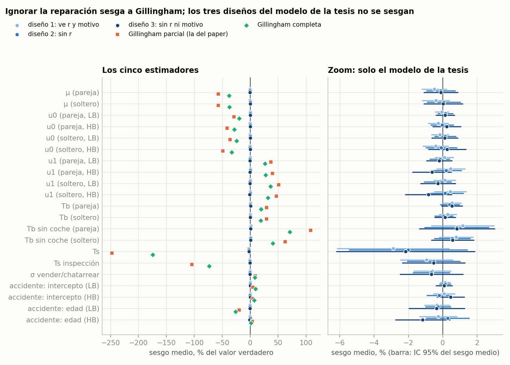
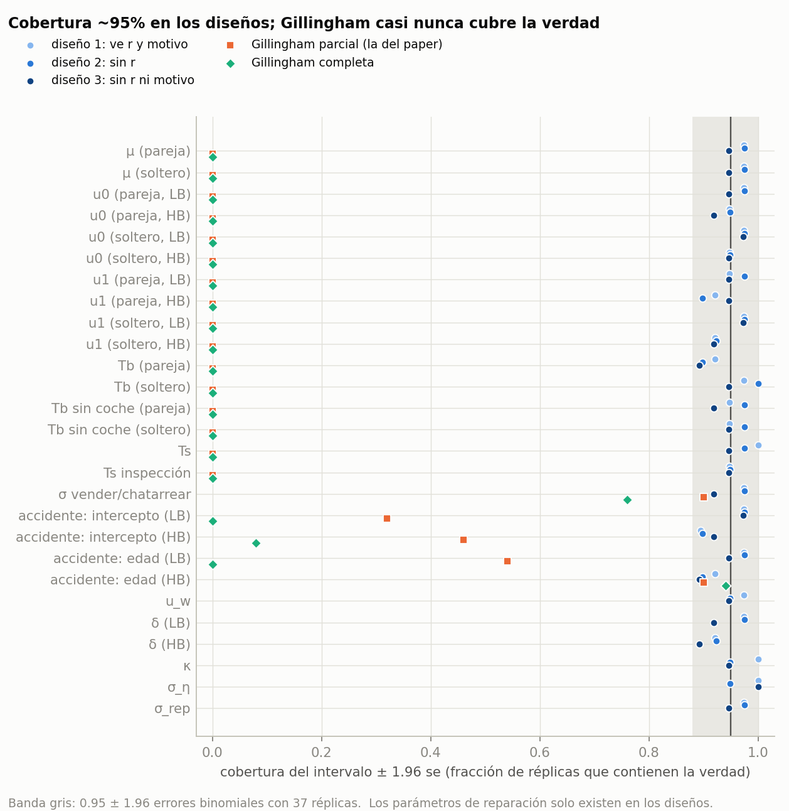
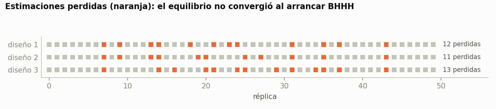
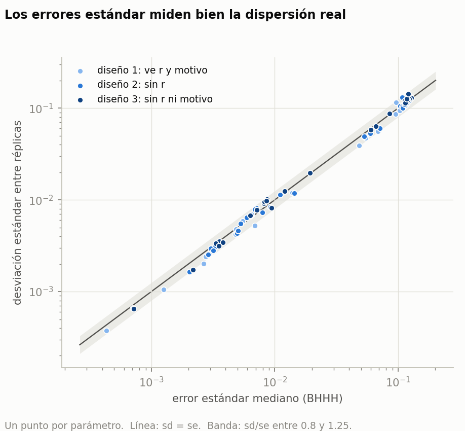
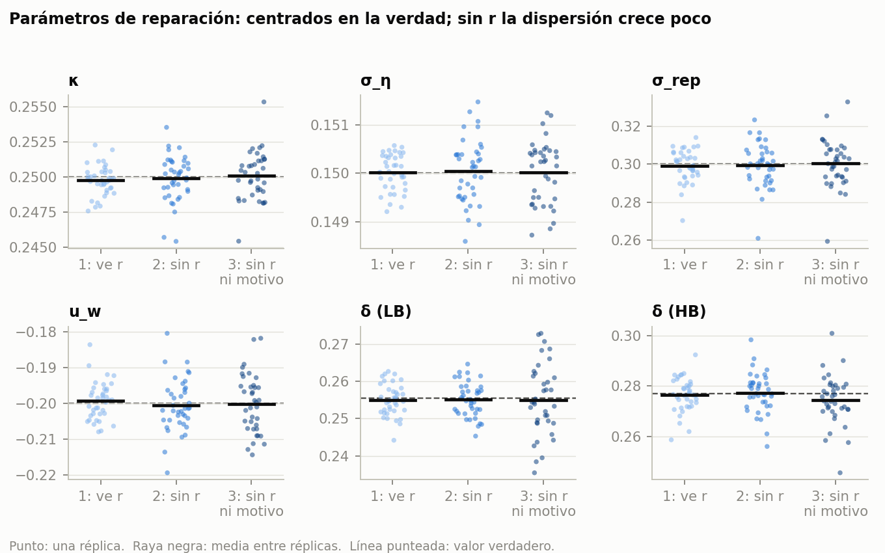

# Reporte: Monte Carlo completo (2026-10-08)

50 réplicas (0-49) del diseño de `modelo_fin.md`: 10,000 hogares por régimen, 4 años, 3
regímenes de R (90,000 transiciones por réplica). Corrido en la workstation (commit 691c378).

- Datos: `claude/niu/output/modelo_tesis/montecarlo/base/`.
- Gráficas y tablas: `claude/niu/output/modelo_tesis/reportes/mc_base/` (`analisis/reporte_mc.py`,
  solo lee CSV; corre en local).
- Réplica 0 en detalle: `reporte_rep0.md`.

## Hallazgos

### 1. El modelo de la tesis no se sesga, en ninguno de los tres diseños

- Sesgo medio < 1% del valor verdadero en casi todos los parámetros. El mayor es Ts (−2 a
  −3%), con t del sesgo entre −1.0 y −1.7: no significativo.
- Cobertura del IC 95% entre 0.89 y 1.00 (banda binomial con ~38 réplicas: 0.88-1.00).
- sd entre réplicas / se mediano entre 0.76 y 1.22: los errores estándar BHHH están bien.
- Los parámetros de reparación (κ, σ_η, σ_rep, u_w, δ) se recuperan sin sesgo aun en el
  diseño 3 (sin r ni motivo de salida); no ver r agranda la dispersión, sobre todo la de δ.
- La tasa de reparación implícita sale 0.276, igual a la verdadera.

### 2. Gillingham sobre los mismos datos está muy sesgado

| | parcial (la del paper) | completa |
|---|---|---|
| μ | −57% | −38% |
| u0 | −29 a −49% | −20 a −33% |
| u1 | +37 a +51% | +26 a +36% |
| Tb | +29% | +19% |
| Tb sin coche | +62 a +108% | +41 a +71% |
| Ts | −248% | −174% |
| Ts inspección | −104% | −73% |
| cobertura | 0 en los 16 parámetros de preferencias y costos | 0 |

Con μ (utilidad marginal del dinero) 40-57% más baja, todo lo que Gillingham expresa en
dinero (u/μ, costos de transacción, disposición a pagar) sale inflado.

### 3. Se perdieron 36 de 150 estimaciones (y no al azar)

12, 11 y 13 en los diseños 1, 2 y 3, todas con "el equilibrio no converge en el valor
inicial de BHHH". Gillingham no perdió ninguna. Las fallas se agrupan por réplica: 31 réplicas sin falla, 7
con una, 7 con dos y 5 con las tres.

**Por qué falla.** Cada evaluación de la verosimilitud necesita el equilibrio (P, EV) en el
θ que se evalúa. Para no resolverlo desde cero (~minutos), `LLEval` parte del equilibrio de
la evaluación anterior y lo corrige con pasos de cuerda (Newton con el jacobiano viejo).
Eso funciona si el θ nuevo está cerca del θ anterior. El "θ anterior" era la **última
evaluación que convergió**, no el mejor punto. En la búsqueda de línea L-BFGS prueba
puntos (a veces lejanos) y los rechaza; el último de esos puntos de prueba se quedaba como
punto de partida. Al terminar L-BFGS, BHHH evaluaba en el θ̂ de L-BFGS partiendo de ese
punto de prueba lejano; la cuerda y el Newton de respaldo no convergían desde ahí y la
excepción tiraba toda la estimación (~2 min de GPU), aunque el equilibrio en θ̂ ya se
había resuelto bien antes.

**Qué implica.**
- No es un problema del modelo ni de la identificación: el equilibrio en θ̂ existe y se
  había encontrado. Es un problema del punto de partida numérico.
- Pero las réplicas perdidas no son al azar. En ellas Gillingham (que sí se estimó)
  da μ y u0 más bajos y u1, Tb más altos (0.5-0.7 sd, el mismo signo en todo el bloque).
  Los paneles que "empujan" el optimizador hacia μ baja hacen búsquedas de línea más
  largas y más fallas. Quitar esas réplicas es selección: los sesgos y coberturas de
  arriba son de una muestra no aleatoria de paneles. Como el sesgo ya es ~0 el efecto
  debe ser chico, pero hay que re-estimar las 36 para reportar el MC limpio.

**Arreglo (en `ll_estim.py`).**
1. `LLEval` guarda también la **mejor** evaluación (mayor LL) con su equilibrio.
2. Al terminar L-BFGS, BHHH arranca en esa mejor evaluación con su equilibrio ya resuelto
   (`restore_best`): la primera evaluación de BHHH no se mueve.
3. Respaldo (`robusto=True`, solo en las evaluaciones de BHHH que no pueden fallar): si la
   cuerda no converge desde el último punto, reintenta desde el mejor y al final resuelve
   desde cero (`solve_regimes`). Contadores `rescate_mejor` y `rescate_frio` en el resumen.
4. `montecarlo.py --solo_faltantes` re-estima solo los (réplica, diseño) sin resultado,
   con la misma semilla (mismo panel), sin Gillingham; escribe `*_faltantes.csv` y guarda
   las fallas que queden en `fallas_reps*.csv`. `reporte_mc.py` las junta solo.

Probado en el juguete (`--smoke`): mismo resultado que antes; con el estado corrupto a
propósito, los rescates desde el mejor y desde cero dan la misma LL (diferencia 7e-10);
`--solo_faltantes` reproduce el panel (misma LL).

Para correrlo en la workstation:

    python -u montecarlo.py --reps 0:50 --solo_faltantes > mc_faltantes.log 2>&1

(~36 × 2.5 min ≈ 1.5 h en una GPU; o partir en `--reps 0:25` y `--reps 25:50`, una por GPU.)

### 4. Costo

~130 s y ~190-210 evaluaciones por estimación en GPU; Gillingham ~20 s en CPU (más cuando
compite por CPU con otra corrida).

