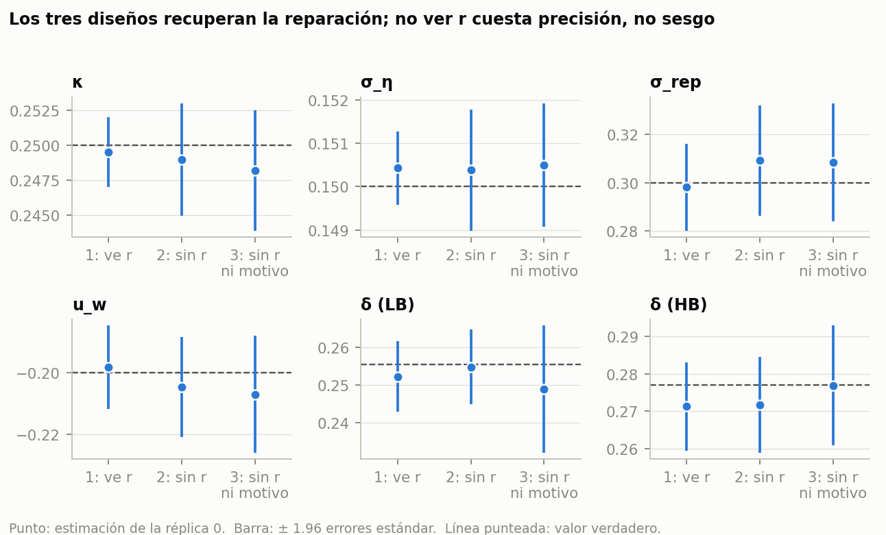
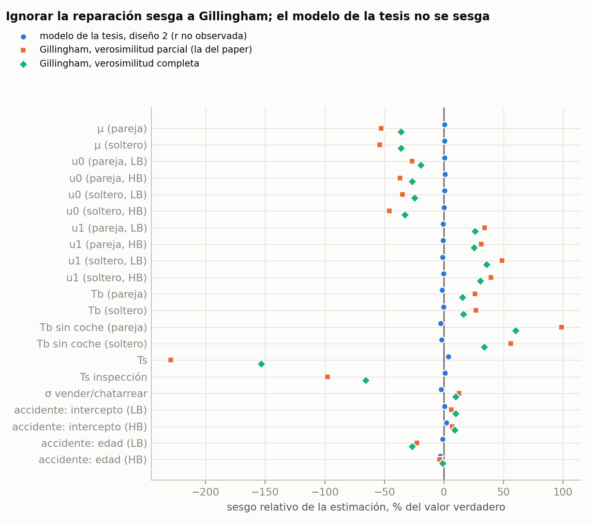
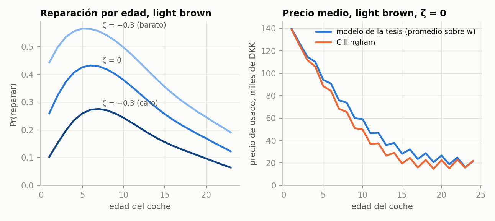

# Reporte: réplica 0 del Monte Carlo (2026-10-08)

Primera estimación completa de `modelo_tesis` en la workstation (GPU), antes de lanzar las
réplicas 1-49.

- **Es una sola réplica.** Los sesgos de abajo son de un panel. Si son sistemáticos lo dirá
  el MC completo.
- Datos: `claude/niu/output/modelo_tesis/montecarlo/base/`.
- Gráficas: `claude/niu/output/modelo_tesis/reportes/rep0/` (`analisis/reporte_rep0.py`).
- Especificación: `modelo_fin.md`.

## Diseño

**Datos verdaderos:** el modelo de la tesis con la calibración aprobada.

- Gillingham (2 marcas: light brown y heavy brown; 2 tipos: pareja y soltero pobres) más
  desgaste en log-odds (σ_η = 0.15, κ = 0.25, u_w = −0.2) y reparación.
- R(LB, a) con prima de coche joven; 3 regímenes de R (ζ = −0.3, 0, +0.3).
- Panel: 10,000 hogares por régimen, 4 años → 90,000 transiciones.

**Cinco estimadores sobre el mismo panel:**

| estimador | qué observa | modelo |
|---|---|---|
| diseño 1 | desgaste w, r (reparó) y motivo de salida | el verdadero |
| diseño 2 | w y motivo de salida; **no r** | el verdadero (mezcla de Hu & Xin) |
| diseño 3 | w; **ni r ni motivo de salida** | el verdadero (dos mezclas) |
| Gillingham parcial | (marca, edad), sin w ni r; no distingue accidente de chatarreo | Gillingham (la verosimilitud del paper) |
| Gillingham completa | lo mismo, distinguiendo accidente | Gillingham |

**Comparación:** los parámetros que comparten los dos modelos (21) tienen el mismo valor
verdadero. El sesgo de Gillingham es su estimación menos ese valor.

## Hallazgos

### 1. El modelo de la tesis recupera todos los parámetros en los tres diseños

- Los 27 parámetros quedan dentro de ±1.96 errores estándar de la verdad en los tres
  diseños. El mayor desvío es de 1.2 se.
- La tasa de reparación implícita (promedio de regímenes, por coche) sale 0.277, 0.281 y
  0.281, contra 0.276 verdadera.

### 2. No ver la reparación cuesta precisión, no sesgo

Error estándar relativo al diseño 1 (que ve r):

| | κ | σ_η | σ_rep | u_w | precio de usado: RMSE contra verdad (mil DKK) |
|---|---|---|---|---|---|
| diseño 1 | 1.0 | 1.0 | 1.0 | 1.0 | 0.22 |
| diseño 2 (sin r) | 1.6 | 1.7 | 1.3 | 1.2 | 0.23 |
| diseño 3 (sin r ni motivo) | 1.7 | 1.7 | 1.4 | 1.4 | 0.48 |

- Aun en el diseño 3, κ tiene un error estándar de 0.0022 (0.9% de κ). Para la regla de la
  réplica 0 (subir N si el se de κ en el diseño 2 pasa de 20% de κ) sobra muestra.
- La pérdida se concentra en los parámetros de reparación (×1.2-1.7). En los parámetros
  compartidos con Gillingham es menor: ×1.03-1.13 en el diseño 2 y ×1.1-1.8 en el 3 (los de
  accidentes son los que más pierden, porque ya no se ve el motivo de salida).
- **Por qué funciona tan bien:** w se observa cada año por coche y el precio de reparar
  mueve mucho la reparación entre regímenes (fig. 3). Esa es la variable excluida de Hu &
  Xin.

### 3. Gillingham, sobre los mismos datos, se sesga mucho

- **Con su verosimilitud (parcial), 19 de sus 21 parámetros quedan fuera de ±1.96 se.** El
  mayor desvío es de 12.6 se.
- La dirección del sesgo es la misma con la verosimilitud completa (que sí ve accidentes)
  pero de la mitad de tamaño. Distinguir accidentes de chatarreo ayuda, pero no corrige.

Lo que aprende mal, en unidades económicas (pareja pobre; miles de DKK, dividiendo entre μ):

| | verdad | Gillingham parcial | Gillingham completa |
|---|---|---|---|
| μ (utilidad marginal del dinero) | 0.113 | 0.054 (−53%) | 0.072 (−36%) |
| disposición a pagar por un año de LB nuevo, u0/μ | 32.3 | 49.9 (+55%) | 40.6 (+26%) |
| disposición a pagar por un año de HB nuevo | 45.6 | 61.0 (+34%) | 52.3 (+15%) |
| caída anual de la utilidad (u1), LB | −0.146 | −0.096 | −0.108 |
| costo de comprar Tb/μ | 58.3 | 155.5 (×2.7) | 105.3 (×1.8) |
| costo de comprar sin coche Tb_nc/μ | 15.8 | 66.5 (×4.2) | 39.6 (×2.5) |
| costo de vender Ts/μ | 8.1 | **−22.0** | −6.7 |
| accidente, pendiente en la edad (LB) | 0.180 | 0.140 | 0.132 |

**Lectura (interpretación tentativa, a confirmar con el MC):**

- **Gillingham ve hogares que se quedan sus coches más tiempo de lo que su modelo
  explica.** En los datos los coches reparados duran y se mantienen bien, pero su modelo no
  tiene reparación.
  - Lo atribuye a que tener coche vale más (u0/μ más alto) y se deprecia más despacio
    (u1 menos negativo).
  - Y a que cambiar de coche es muy caro: Tb casi se triplica.
- **Para cuadrar las ventas de usados con un Tb tan alto, el costo de vender se vuelve
  negativo**, es decir, un subsidio. No tiene interpretación económica.
- **Con μ a la mitad, todo en dinero se infla.** Es lo que más importaría para
  contrafactuales de impuestos o subsidios, que dependen de μ.
- **Los accidentes por edad salen más planos:** más accidentes de jóvenes y menos
  crecimiento con la edad. La reparación hace que los coches viejos se descompongan menos
  de lo que predice su curva lineal.

### 4. El modelo teórico se comporta como se pidió

- La reparación de light brown es baja de joven, sube hasta la edad 5-7 y baja al final.
  Se desplaza mucho entre regímenes.
- Los precios medios (promediados sobre w) bajan como en Gillingham, ~5-9 mil DKK arriba en
  edades medias. La distribución por (marca, edad) es casi igual.
- Heavy brown repara poco y casi nada después de la edad 10. Se dejó así por decisión del
  autor.

### 5. Optimización

- **Máximos locales:** el arranque perturbado 1 llegó al mismo óptimo que el arranque en la
  verdad en los tres diseños (la LL coincide a 1e-8 por observación).
- **El arranque perturbado 2 falló en los tres diseños:** el equilibrio no convergió en ese
  punto inicial (10% de perturbación). Es un problema del solver al arrancar lejos, no de
  la verosimilitud. Se arregla con continuación desde la verdad.
- L-BFGS se detiene por "reducción relativa" en 140-195 iteraciones. BHHH termina en 2-3
  iteraciones con g'B⁻¹g/N < 1e-9. Todos los arranques en la verdad reportan convergencia.

## Tiempos (GPU, Quadro GV100)

| | diseño 1 | diseño 2 | diseño 3 | Gillingham (CPU, en paralelo) |
|---|---|---|---|---|
| segundos (arranque en la verdad) | 213 | 141 | 101 | ~40 (las dos) |
| evaluaciones de la LL | 216 | 184 | 156 | 560 |

- Una réplica normal (solo desde la verdad) tarda **~7.5 min**. Las 49 restantes en 2 GPUs:
  **~3-3.5 h**. La réplica 0 tardó 30 min por los arranques perturbados.
- **Del tiempo de cada estimación, ~80% se va en las primeras 10 iteraciones:** la
  compilación de JAX más un primer paso de L-BFGS demasiado grande (44 refactorizaciones del
  jacobiano). Optimizarlo bajaría la réplica a ~2 min. No hace falta para este MC.

## Advertencias

1. Una réplica: no hay sd entre réplicas ni cobertura. El sesgo de Gillingham es muy grande
   respecto a su se, pero hay que confirmarlo.
2. El sesgo depende de la calibración del modelo verdadero (u_w, κ, R). Con u_w = 0 (que el
   autor quiere probar), reparar solo alarga la vida del coche, y el sesgo de las
   utilidades podría cambiar.
3. Los errores estándar son BHHH en la réplica. Que coincidan con la dispersión entre
   réplicas se verifica con el MC.

## Siguiente

- Correr las réplicas 1-49 (comandos en `modelo_tesis.md`, sec. 7) y armar
  `--summarize`: sesgo, sd, se mediano, RMSE y cobertura de los 5 estimadores.
- Con el MC: un contrafactual (p. ej. subir R 20%) con los θ̂ de Gillingham contra la verdad,
  para medir el sesgo en lo que importa para política.
